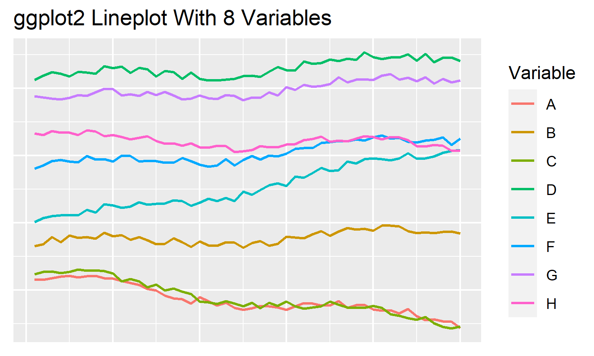
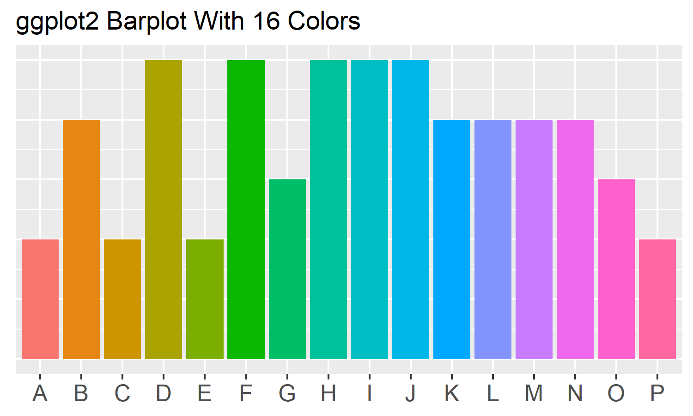

Graph Color Palettes
====================

Are you looking for a highly contrasting color palette that works well
in graphs?

Here is a collection of color palettes that I like to use.

ggplot2 (R programming language)
--------------------------------

### Contrasting Color Palettes

One of the most common discrete color combinations for statstical plots
comes from R’s ggplot2 package. The standard palettes vary as the number
of variables increase, but the same low-hue version of red is common to
all. The first 16 color combinations are as follows:

These are some of my favorite color combinations. We can see that, even
with a large number of variables, clear and contrasting plots can be
achieved.

Code

Heading
-------

1.  A numbered
2.  list
    -   With some
    -   Sub bullets

More to come…
