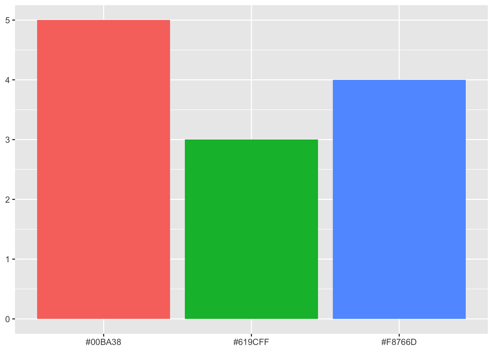
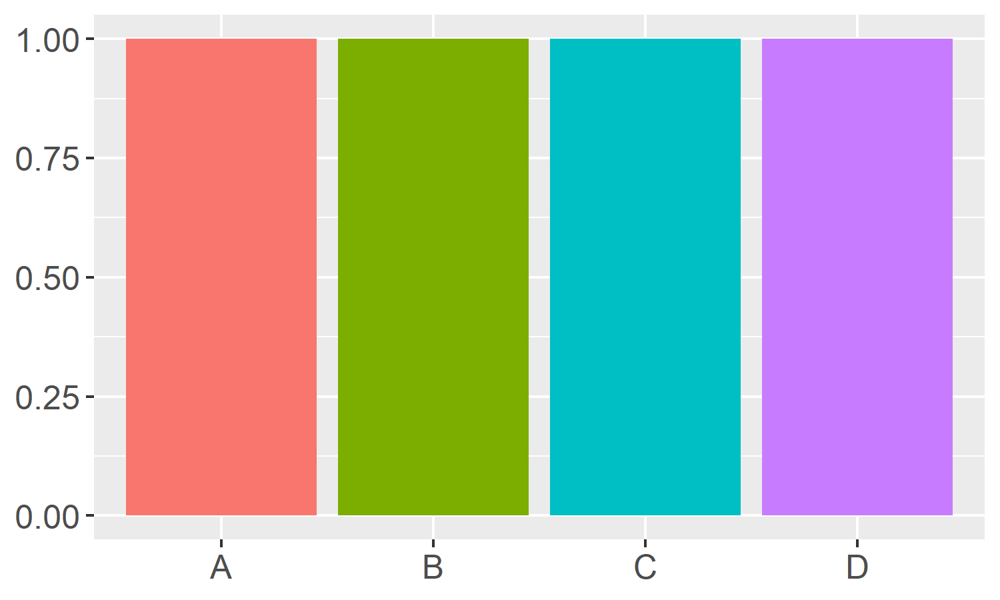
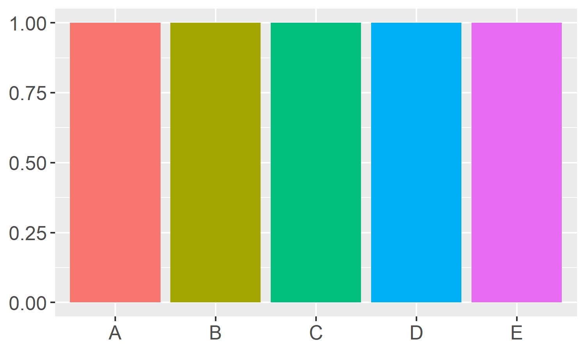

```{r include=FALSE}
library(tidyverse)
library(magrittr)
library(readxl)
library(ggplot2)
```

# Graph Color Palettes

Are you looking for a highly contrasting color palette that works well in graphs?

Here is a collection of color palettes that I like to use.

## ggplot2 (R programming language)

### Triadic Colors

One of the most common triadic color schemes for statstical plots is the base color palette from R's ggplot2 package. The standard discrete color palette for three colors produced through ggplot2 is the following:

(\#EC746B, \#60BB3B, \#619CFB)

```{r echo=FALSE, message=FALSE}
bar_data <- tibble(item=c("#EC746B", "#60BB3B", "#619CFB"), count=c(4,5,3))
bar_data$item <- factor(bar_data$item,levels = c("#EC746B", "#60BB3B", "#619CFB"))
a <- ggplot(bar_data, aes(x=item, y=count, fill=item)) +
  geom_bar(stat="identity") +
  theme(axis.title.x = element_blank(),
        axis.text.x = element_text(size=12),
        axis.title.y = element_blank(),
        axis.text.y = element_text(size=12),
        legend.position = "none")
ggsave(a, filename="ggplotStandard3.png", width=5, height=3)
```


### Four plus colors

ggplot2 has additional discrete palettes of contrasting colors.

Four colors:
```{r echo=FALSE, message=FALSE}
bar_data <- tibble(item=c("#EC746B", "#60BB3B", "#619CFB", "Abc"), count=c(4,5,3,4))
bar_data$item <- factor(bar_data$item,levels = c("#EC746B", "#60BB3B", "#619CFB", "Abc"))
a <- ggplot(bar_data, aes(x=item, y=count, fill=item)) +
  geom_bar(stat="identity") +
  theme(axis.title.x = element_blank(),
        axis.text.x = element_text(size=12),
        axis.title.y = element_blank(),
        axis.text.y = element_text(size=12),
        legend.position = "none")
ggsave(a, filename="ggplotStandard4.png", width=5, height=3)
```



Five colors:
```{r echo=FALSE, message=FALSE}
bar_data <- tibble(item=c("#EC746B", "#60BB3B", "#619CFB", "Abc", "Efg"), count=c(4,5,3,4,5))
bar_data$item <- factor(bar_data$item,levels = c("#EC746B", "#60BB3B", "#619CFB", "Abc", "Efg"))
a <- ggplot(bar_data, aes(x=item, y=count, fill=item)) +
  geom_bar(stat="identity") +
  theme(axis.title.x = element_blank(),
        axis.text.x = element_text(size=12),
        axis.title.y = element_blank(),
        axis.text.y = element_text(size=12),
        legend.position = "none")
ggsave(a, filename="ggplotStandard5.png", width=5, height=3)
```



Six colors:
```{r echo=FALSE, message=FALSE}
bar_data <- tibble(item=c("#EC746B", "#60BB3B", "#619CFB", "Abc", "Efg", "Hij"), count=c(4,5,3,4,5,3))
bar_data$item <- factor(bar_data$item,levels = c("#EC746B", "#60BB3B", "#619CFB", "Abc", "Efg", "Hij"))
a <- ggplot(bar_data, aes(x=item, y=count, fill=item)) +
  geom_bar(stat="identity") +
  theme(axis.title.x = element_blank(),
        axis.text.x = element_text(size=12),
        axis.title.y = element_blank(),
        axis.text.y = element_text(size=12),
        legend.position = "none")
ggsave(a, filename="ggplotStandard6.png", width=5, height=3)
```


More to come...