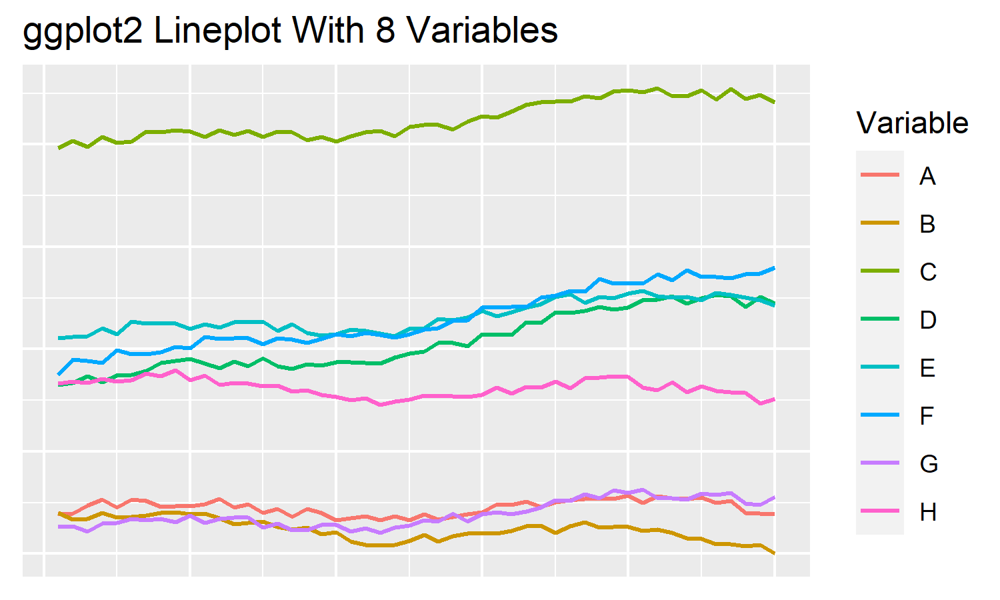

```{r include=FALSE}
library(tidyverse)
library(magrittr)
library(readxl)
library(ggplot2)
```

# Graph Color Palettes

Are you looking for a highly contrasting color palette that works well in graphs?

Here is a collection of color palettes that I like to use.

## ggplot2 (R programming language)

### Contrasting Color Palettes

One of the most common discrete color combinations for statstical plots comes from R's ggplot2 package. The standard palettes vary as the number of variables increase, but the same low-hue version of red is common to all. The first 16 color combinations are as follows:


These are some of my favorite color combinations. We can see that, even with a large number of variables, clear and contrasting plots can be achieved.

<details>
  <summary>ggplot Lineplot With 8 Variables </summary>
  
```{r echo=TRUE, message=FALSE}
time_stops <- 50
num_vars <- 8
line_data <- tibble(time=rep(1:time_stops, num_vars),
                    count=runif(time_stops*num_vars,1,7) + rep(runif(num_vars,1,200), each=time_stops),
                    var_n=rep(LETTERS[1:num_vars], each=time_stops))
line_data %<>% group_by(var_n) %>%
  mutate(count = count + (time^(1.03))*runif(1,-1,1)*50/time_stops) %>%
  ungroup() %>%
  mutate(count = count + 5*sin(time/5) + time^(1.03)/10)

a <- ggplot(line_data, aes(x=time, y=count, color=var_n)) +
  geom_line(size=0.7) +
  labs(title="ggplot2 lineplot with 8 variables",
       color="Variable") +
  theme(axis.title.x = element_blank(),
        axis.text.x = element_blank(),
        axis.title.y = element_blank(),
        axis.text.y = element_blank(),
        axis.ticks.x = element_blank(),
        axis.ticks.y = element_blank())
ggsave(a, filename="ggplotLine16.png", width=5, height=3)
```
</details>





```{r echo=FALSE, message=FALSE}
bar_data <- tibble(item=c("A","B","C","D","E","F","G","H","I","J","K","L","M","N","O","P"), count=c(4,5,3,4,5,3,2,5,3,4,5,3,4,5,4,3))
bar_data$item <- factor(bar_data$item,levels = c("A","B","C","D","E","F","G","H","I","J","K","L","M","N","O","P"))

a <- ggplot(bar_data, aes(x=item, y=count, fill=item)) +
  geom_bar(stat="identity") +
  labs(title="ggplot2 barplot using 16 colors") +
  theme(axis.title.x = element_blank(),
        axis.text.x = element_text(size=12),
        axis.title.y = element_blank(),
        axis.text.y = element_blank(),
        legend.position = "none",
        axis.ticks.y = element_blank())
ggsave(a, filename="ggplotStandard16.png", width=5, height=3)
```


More to come...