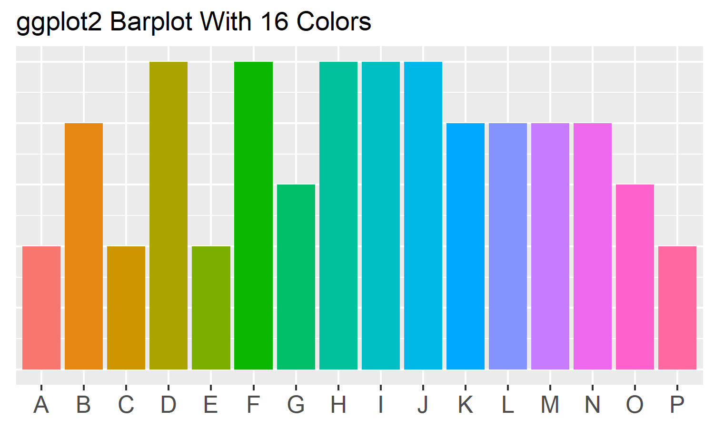

```{r include=FALSE}
library(tidyverse)
library(magrittr)
library(readxl)
library(ggplot2)
```

# Graph Color Palettes

Are you looking for a highly contrasting color palette that works well in graphs?

Here is a collection of color palettes that I like to use.

## ggplot2 (R programming language)

### Contrasting Color Palettes

One of the most common color schemes for statstical plots is the base color palette from R's ggplot2 package. The standard discrete color palettes for ggplot2 and some variations are as follows:


```{r echo=FALSE, message=FALSE}
bar_data <- tibble(item=c("A","B","C","D","E","F","G","H","I","J","K","L","M","N","O","P"), count=c(4,5,3,4,5,3,2,5,3,4,5,3,4,5,4,3))
bar_data$item <- factor(bar_data$item,levels = c("A","B","C","D","E","F","G","H","I","J","K","L","M","N","O","P"))
a <- ggplot(bar_data, aes(x=item, y=count, fill=item)) +
  geom_bar(stat="identity") +
  theme(axis.title.x = element_blank(),
        axis.text.x = element_text(size=12),
        axis.title.y = element_blank(),
        axis.text.y = element_text(size=12),
        legend.position = "none")
ggsave(a, filename="ggplotStandard16.png", width=5, height=3)
```




More to come...